

## Отчет

## Практическая работа 1 [HomeP]

## Знакомство с Android Studio

---

**ФИО:** Лапшин Никита Евгеньевич  
**Курс:** 1
**Группа:** ИНС-б-о-24-1  
**Направление:** 09.03.02 «Информационные системы и технологии»  

---

### Цель работы

Изучение интерфейса Android Studio и создание первого простого приложения.

### Ход работы

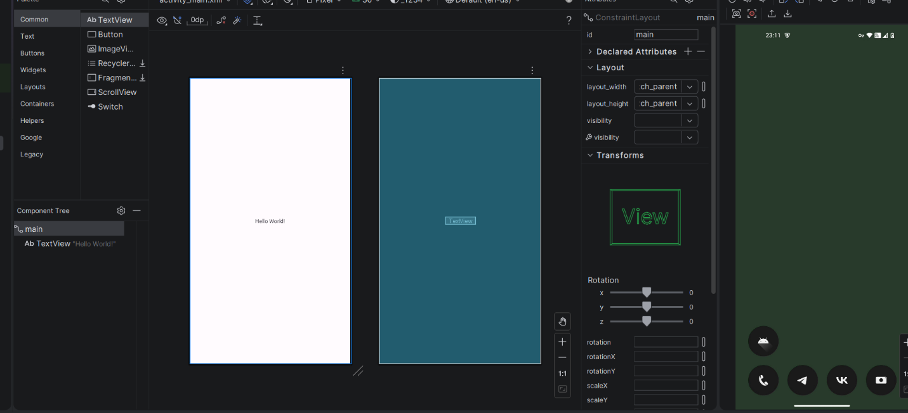

Рисунок 1 – Окно отладки и первый взгляд на приложение

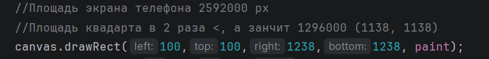

Рисунок 2 – Интерфейс Java. Рабочая область

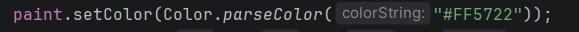

Рисунок 3 – Интерфейс xml. Содержимое файла AndroidManifest.xml

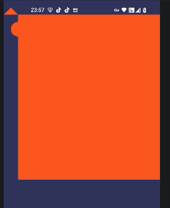

Рисунок 4 – Содержимое файла String.xml

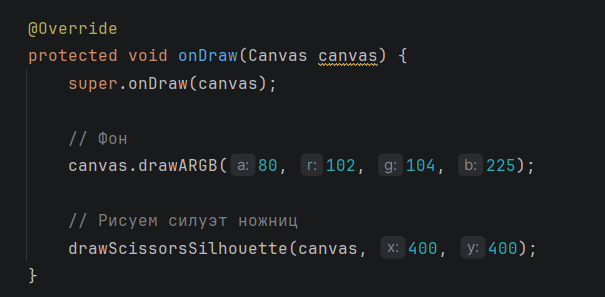

Рисунок 5 – Создание класса DrawView

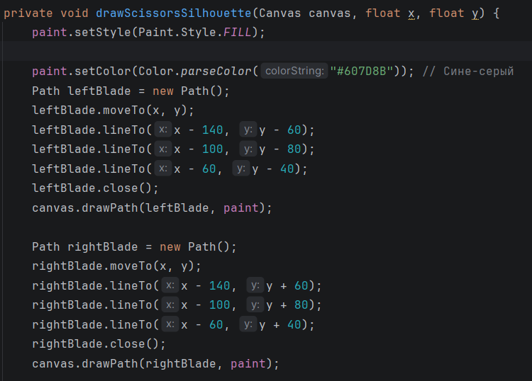

Рисунок 6 – Создание метода для рисования и создание прямоугольника и круга красного цвета

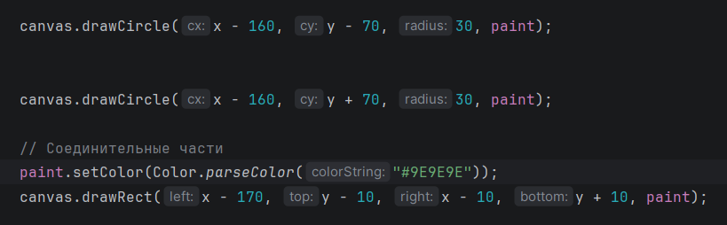

Рисунок 7 – Создание отрезка

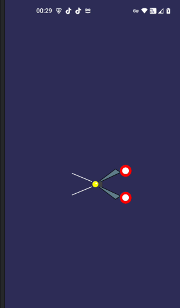

Рисунок 8 – Создание треугольника

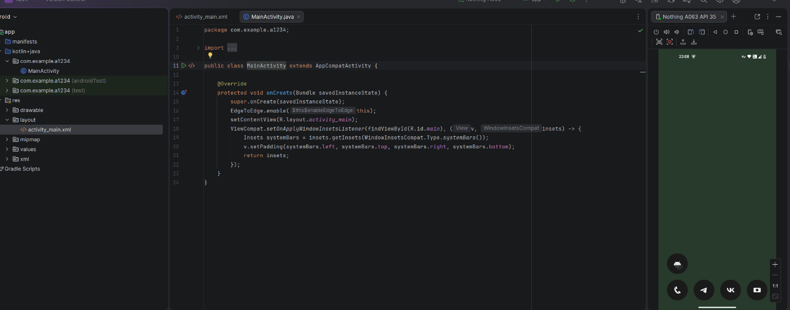

Рисунок 9 – Результат проделанной работы

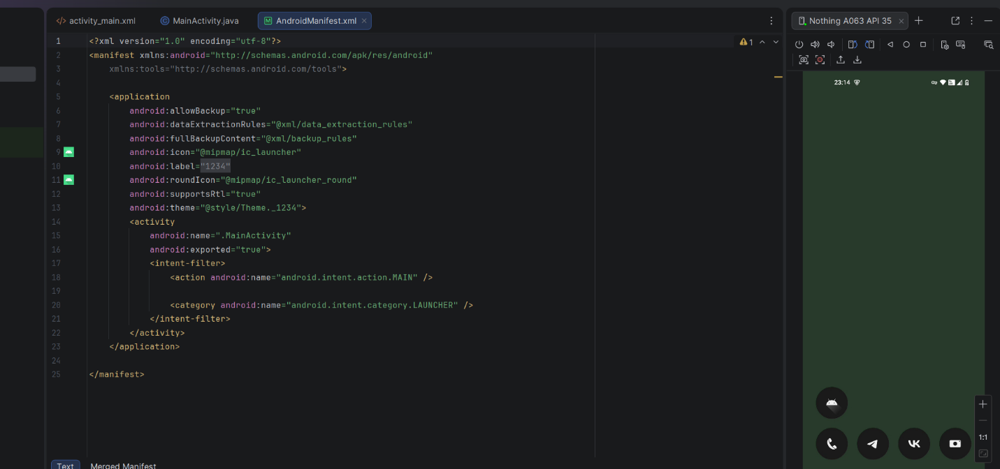

Рисунок 10 – Расчет и создание квадрата

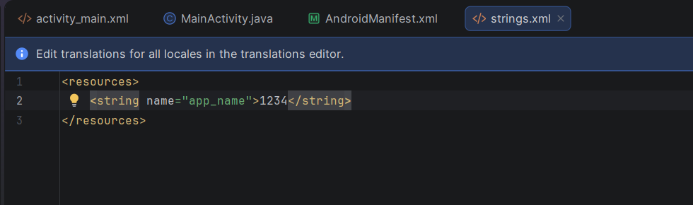

Рисунок 11 – Заливка фигуры оранжевым цветом

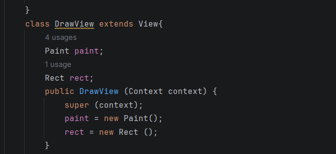

Рисунок 12 – Результат выполнения задания

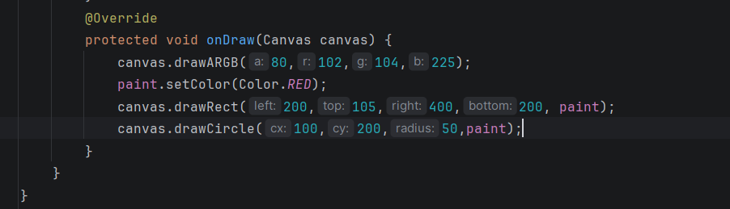

Рисунок 13 – Создание класса onDraw, холста и создание силуэта ножниц

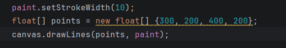

Рисунок 14 – Создание ручек

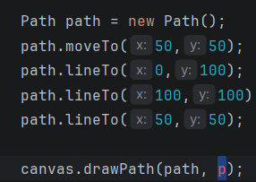

Рисунок 15 – Создание рукояток красного цвета и соединения

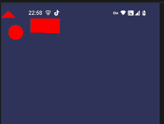

Рисунок 16 – Результат выполнения работы

### Вывод

В ходе выполнения работы была изучена структура и основные компоненты интегрированной среды разработки Android Studio. Рассмотрены ключевые элементы интерфейса: редактор кода, панель инструментов, окно проекта (Project), менеджер виртуальных устройств (AVD) и эмулятор. Освоен процесс создания нового проекта с использованием стандартного шаблона, настройка минимальной версии SDK и выбор языка программирования (Java). Выполнена сборка и запуск простейшего приложения с геометрическими фигурами и рисунками.

### Контрольные вопросы

1. **Понятие виджета** — это графический элемент пользовательского интерфейса (кнопка, текстовое поле, переключатель), который отображается на экране и взаимодействует с пользователем. В Android виджеты являются подклассами `View` (например, `Button`, `TextView`, `EditText`).
2. **Графические примитивы** — базовые геометрические фигуры (прямоугольник, круг, линия, овал, точка), используемые для построения сложных изображений. В Android создаются через XML в папке `drawable` с помощью тега `<shape>`.
3. **Переопределение метода** — это механизм в ООП, позволяющий подклассу изменить реализацию метода, унаследованного от родительского класса. В Java используется аннотация `@Override`.
4. **Наследование** — принцип ООП, при котором класс (дочерний) получает свойства и методы другого класса (родительского). В Android все классы активностей наследуются от `AppCompatActivity`, а виджеты — от `View`.

